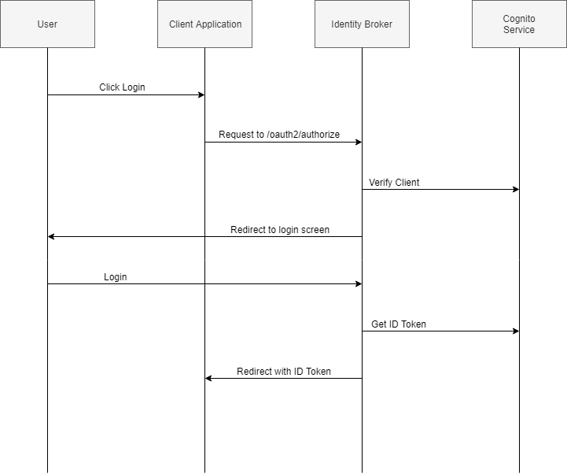
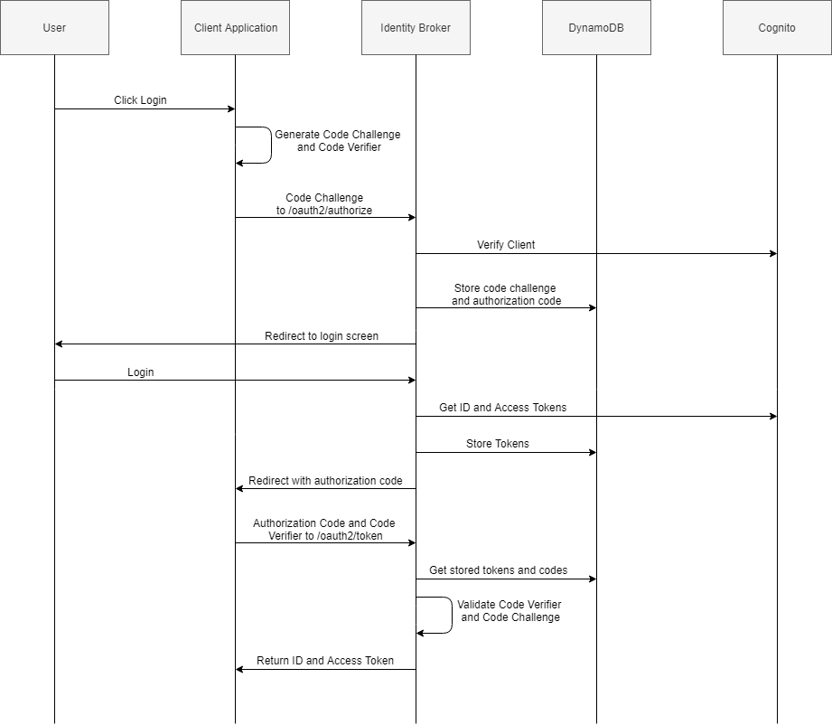

[User Documentation](UserDocumentation.md) / __[Client Developer Documentation](ClientDeveloperDocumentation.md)__ / [Developer Documentation](DeveloperDocumentation.md)

# Client Developer Documentation

This document explains how to use the broker as a login solution for your websites and mobile application.

Before any client to be able to use the _AWS Amplify Identity Broker_ you'll need to [register your client](https://github.com/awslabs/aws-amplify-identity-broker/blob/master/Documentation/UserDocumentation.md#register-a-client) and get a `client_id` as a result.

# Instruction for an AWS Amplify client

If you use Amplify, the replacement of a Cognito user pool (the default auth backend fro an Amplify app) by the broker is transparent.
The only configuration your client need is the Auth configuration pointing to the AWS Amplify broker domain instead of a Cognito User Pool.

Here is an example of configuration:

```
import { Auth } from "aws-amplify";

Auth.configure({
  userPoolId: "us-west-2_XXXXXXXXX",               // This won't be used, but needs to match Cognito User Pool ID format
  userPoolWebClientId: "<your-app-client-id>",
  oauth: {
    domain: "<your-broker-domain>",                // do not include https://
    scope: ["email", "profile", "openid"],
    redirectSignIn: "<your-client-redirect-uri>",  // Something like https://client1.example.com
    redirectSignOut: "<your-client-logout-uri>",   // Something like https://client1.example.com/logout
    responseType: "code",
  },
})
```

Then the rest of you code can remain unchanged, you can use `Auth.federatedSignIn` to login.
See the [AWS Amplify documentation](https://docs.amplify.aws/lib/auth/advanced/q/platform/js) for more information and the [API Doc](https://aws-amplify.github.io/amplify-js/api/classes/authclass.html) for all `Auth` methods.

You can find a working example [here](https://github.com/awslabs/aws-amplify-identity-broker-client) (this project uses AWS Amplify but you are free to use anything else).

___Note:__ AWS Amplify `Auth.federatedSignIn` uses PKCE flow by default._

# Instruction for any other client (not using AWS Amplify)

## Choose your flow (Implicit, PKCE)

The AWS Amplify identity broker exposes two standard Oauth2 authentication flows __Implicit__ and __PKCE__. You can create different client using different flows at the same time.

### Implicit flow

This is the simpler flow. It require just a link from your app and for you to read a GET parameter.

This flow only returns an _id_token_ you __should not__ use an id_token to authenticate a user against a backend. This is a [recommendation from the Oauth2 BCP](https://tools.ietf.org/html/draft-ietf-oauth-security-topics-09#section-2.1.2)

<details>
  <summary>Diagram of the flow (click to expand)</summary>

  Flow entities are:
  * __User__: the user and his browser
  * __Client Application__: (like the one from our [client demo project](https://github.com/awslabs/aws-amplify-identity-broker-client))
  * __Identity Broker__ : the main project
  * __DynamoDB__: the broker storage layer
  * __Cognito__: The Cognito service and endpoints

  __Implicit flow__

  
</details>

### PKCE flow

PKCE (Proof Key for Code Exchange) is the most secured flow. Because it does not provide token through redirection he is considered safer for mobile applications.
It will require you to generate random strings, apply some hashed and exchange information two times with the broker.

Expand the section below to see the detailed flows:

<details>
  <summary>Diagram of the flow (click to expand)</summary>

  Flow entities are:
  * __User__: the user and his browser
  * __Client Application__: (like the one from our [client demo project](https://github.com/awslabs/aws-amplify-identity-broker-client))
  * __Identity Broker__ : the main project
  * __DynamoDB__: the broker storage layer
  * __Cognito__: The Cognito service and endpoints

  
</details>

## How to create a login button/link

Depending of the flow the steps will differ.

<details>
  <summary>Implicit flow</summary>
  The initial link to create has to be like this:

  ```
  https://<broker-domain>/oauth2/authorize?redirect_uri=<your-client-callback-URL>&client_id=<your-client-id>&response_type=id_token
  ```

  The _client_id_ and _redirect_uri_ has to be exactly the ones your registered in the broker DynamoDB table _amplifyIdentityBrokerCodesTable_ (see [How to register a client](./UserDocumentation.md#register-a-client))

  Once the client logged in successfully, the broker will redirect the browser of the client to your callback with the id_token as a GET parameter.

  ```
https://<your-client-callback-URL>/?id_token=...JWT-token-base64 encoded...
  ```

  In your application store the JWT token with your favorite method (Cookie, local storage, ...).

  You can decrypt the token content by reading the base64 content.

  An example code in javascript to do that (using the library [jwt_decode](https://github.com/auth0/jwt-decode)):

  ```
  import jwt_decode from 'jwt-decode';
  var idTokenDecoded = jwt_decode(idToken);
  var tokenExpiry = idTokenDecoded['exp'];  <-- an example field you can read
  ```

  The token is only valid until an expiration date (```exp``` field in the previous code sample) this validity duration is customizable (see [feature description](https://aws.amazon.com/about-aws/whats-new/2020/08/amazon-cognito-user-pools-supports-customization-of-token-expiration/)).

  __Note__: _By default the implicit flow returns only the id_token. You can read the information it contains to display custom information to the user but you __should not__ use an id_token to authenticate a user against a backend. This is a [recommendation from the Oauth2 BCP](https://tools.ietf.org/html/draft-ietf-oauth-security-topics-09#section-2.1.2)_
</details>

<details>
  <summary>PKCE flow</summary>

  PKCE flow has been designed to secure Single Page Application and apps therefore you can execute all the following in the browser. You can also do some of the requests in your backend but this is not mandatory.

  Before redirecting the browser to the broker you need to generate a ```code_challenge``` and ```code_verifier```.

  A ```code_verifier``` is just a random string encoded as base 64, this is a secret that only your application will know.
  The ```code_challenge``` is derivate from the code verifier with a sha256 algorithm.
  There is no way to retrieve the ```code_verifier``` from the ```code_challenge```, but it is easy to calculate the ```code_challenge``` from the ```code_verifier```.

  Here is the code to do so in Javascript:

  ```
  import crypto from "crypto";

  function base64URLEncode(buffer: Buffer): string {
    return buffer.toString("base64")
        .replace(/\+/g, "-")
        .replace(/\//g, "_")
        .replace(/=/g, "");
  }

  function sha256(str: string): Buffer {
    return crypto.createHash("sha256").update(str).digest();
  }

  // Generate a random 32 bytes string and encode
  var code_verifier = base64URLEncode(crypto.randomBytes(32));

  // Generate the code challenge from the verifier
  var code_challenge = base64URLEncode(sha256(codeVerifier));
  ```

  Once these value are generated you can redirect the browser (webview in the case of a native mobile application) to an url of the following form:

  ```
  https://<broker-domain>/oauth2/authorize?redirect_uri=<your-client-callback-URL>&client_id=<your-client-id>&response_type=code&code_challenge=<your-code-challenge>&code_challenge_method=S256
  ```

  After the user successfully log in the broker will redirect to your client application using your redirect_uri and adding the ```code``` parameters:

  ```
  https://<your-client-callback-URL>?code=09cecb8f-cd25-462a-a3f2-fd6d73eb4da7
  ```

  After that you can do a __POST request__ to the broker _/oauth2/token_ endpoint with the ```code``` and the original ```code_verifier``` from your application:

  ```
  POST https://<broker-domain>/oauth2/token
  Content-Type='application/x-www-form-urlencoded'

  grant_type=authorization_code&
  client_id=<your-client-id>&
  code=<your-code>&
  code_verifier=<your-code-verifier>
  ```

  The broker response should look like that:

  ```
  HTTP/1.1 200 OK
  Content-Type: application/json

  {
  "access_token":"XXXXXXX",
  "refresh_token":"XXXXXXXX",
  "id_token":"XXXXXXX",
  "token_type":"Bearer",
   "expires_in":3600
  }
  ```

  In your application store the three tokens with your favorite method (Cookie, local storage, ...).

  * __access_token__: Is the one you should use to get access to your backend APIs It contains only a user id and Oauth scopes.
  * __id_token__: Is the token that contains the description of your user (login, phone number, custom attributes, ... the exact list depend of your COgnito configuration)
  * __refresh_token__: Is the token you should use to renew the two other token once expired without requiring your user to login again (here after one hour). See _How to refresh tokens_ section for details.

  Expiration duration is customizable (see [feature description](https://aws.amazon.com/about-aws/whats-new/2020/08/amazon-cognito-user-pools-supports-customization-of-token-expiration/)).


  Once you get your tokens from the broker you can use them directly against your backend.
  In the backend you will need to verify the JWT token signature (see _How to verify a JWT token_ section below).

  _Note: You can refer to the [OAuth 2.0 RFC 7636](https://tools.ietf.org/html/rfc7636) to check your implementation._
</details>

## How to redirect from authenticated page when no JWT token provided

If a user of your application bookmarked a page of your application (or send a link to a friend) and if this page requires authentication it is possible that the user won't have a valid JWT token.

In that case you have to redirect him to the broker using the same method as the login (see previous section).

_Note: You cannot redirect the user back to the current page but only to your application registered redirect_uri. This is a security measure to make sure an attacker cannot pass a redirect_uri to a page he is in control of. You can fork the broker to change that but we do not recommend to do so._

## How to create a logout link

When you want to logout from your application you just have to destroy the JWT tokens you have from your browser (or app) storage (cookie, local storage, session storage, ...). But doing so will only log you out of your current application.

If you want to logout from the broker itself (preventing any other client application to reuse the current session) then you have to invoke the broker logout flow.

Here is the url you have to redirect the browser to:

```
https://<broker-domain>/logout?logout_uri=<your-client-redirect-uri>&client_id=<your-client-id>
```

The _client_id_ and _logout_uri_ has to be exactly the ones your registered in the broker DynamoDB table _amplifyIdentityBrokerCodesTable_ (see [How to register a client](./UserDocumentation.md#register-a-client)). _logout_uri_ has to be equal to the _redirect_uri_ value of the table.

## How to create a switch user

The switch user flow is almost the same than the logout flow. The difference is that after logout the logout flow redirect to your app immediately where in the switch user flow the broker will show again the login form to the user and only redirect to your app if successful.

```
https://<broker-domain>/logout?redirect_uri=<your-client-redirect-uri>&client_id=<your-client-id>&response_type=id_token
```

## How to create a signup link

... coming soon ...

## How to direct to the account settings page

The broker offers a page that allow a user to see their personal information that Cognito (or a 3rd party IdP) stores and update some of the values.

... coming soon ...

## How to direct to the account security settings page

The broker offers a page that allow a user to see and update their MFA preference.
The broker support MFA by SMS or OTP (One Time Password).

... coming soon ...

## How to direct to the SSO dashboard

The broker offers a page that allow a user to see all the clients he has access to.

_Note: All user will have the same list. If you want a custom list depending of the user you have to fork the broker project and do it yourself_

Upon login, all users will be automatically redirected to the dashboard page

Alternatively, you can access the dashboard page through this link

Broker URL:

```
https://<broker-domain>/dashboard
```

The part of the code that setup the redirection after login is available in `App.js` under `handleAuthUIStateChange()` function:
```js
else { // Sign in directly to broker (not from redirect from client as part of oauth2 flow)
  window.location.href = '/dashboard';
}
```

## How to verify a JWT token

Verifying a token is an operation that require you to use the public key (also named __JSON Web Key__) of the signing authority (your Cognito user pool in the case of a broker).
You can download the key from the Cognito URL or from the broker helper function URL:

Cognito URL:

```
https://cognito-idp.{region}.amazonaws.com/{userPoolId}/.well-known/jwks.json
```

Broker URL:

```
https://<broker-domain>/.well-known/jwks.json
```

See [how to verify a token](https://docs.aws.amazon.com/cognito/latest/developerguide/amazon-cognito-user-pools-using-tokens-verifying-a-jwt.html)) from more detail.

## How to refresh the tokens

## Migration instructions

If you have an existing pool of user in your application that you need to migrate you'll have to migrate them into the Cognito user pool of the broker (see [migration instructions](./UserDocumentation.md#migration-instructions)).

## If you use a standard OIDC client

The AWS Amplify Identity broker follows the [OpenID Connect 1.0 specification](https://openid.net/specs/openid-connect-core-1_0.html).

You may already have an existing application that is a OIDC standard client.

If this is the case you can integrate your application with the broker but keep in mind that:
* not all the flows and endpoint are implemented
* the broker is not 100% standard see the [differences with the OIDC standard](./UserDocumentation.md#differences-with-the-oidc-standard) section.

