# User Documentation

This document explains how to use the broker:

* How to deploy
* How to customize
* How to migrate from an existing user pool system

## Presentation

The AWS Amplify Identity Broker is a centralized login solution. It is a component you can use to authenticate your user on all your websites and applications:


The broker will be deployed within your own AWS account and will be in your full control (see _Deployment_ section).

Using the broker your users will have the same unique identity accross all your websites and applications. The broker provides Single Sign On (SSO): your users will have to login only once to be authenticated on all your services (but can have different permission levels specific to every application).

Optionaly you can add external IdP (Identity Providers) to the broker. Which means that the user can sign-in using your corporate (or your customer corporate) Active Directory or using Facebook, Google or Amazon login or any OIDC and SAML IdP. Technically you can add up to 300 IdPs to your broker (limit coming from Amazon Cognito documented [here](https://docs.aws.amazon.com/cognito/latest/developerguide/limits.html)). Today user coming from any client will see the same list of IdPs but you can fork the broker project and customize the behavior to make the list dynamic and for example:

* show the corporate IdP to people accessing the broker from your office private network
* show a list of IdP specific to a customer by giving them a special URL (like a link with a get parameter flag)
* show a list of IdP specific to a client application

__Note that even if your users login in with a 3rd party IdP they will have a unique and peristent identity within the broker__ (under the hood a Amazon Cognito user pool identity).

In term of UI customization because you are in control of the source code and the deployment infrastructure you can make any change you like.
The same applies for flow customization where all the front end part are customizable using the broker and backend flows can be customized using [Amazon Cognito Lambda Triggers](https://docs.aws.amazon.com/cognito/latest/developerguide/cognito-user-identity-pools-working-with-aws-lambda-triggers.html). The broker already leverage some of these triggers to introduce special feature like i18n (internationalization).

Finaly the broker is a living open source project and your contributions are welcome if you see a missing feature that can be useful to all the broker users. Please see the [Developer Documentation](./DeveloperDocumentation.md) if you are interested by contributing.

### Choose your flow

Selecting an authentication flow is a critical decision in term of security. We support several options to allow you connecting existing application that supports only one specific flow.

The AWS Amplify identity broker exposes two standard Oauth2 authentication flows:
* __Implicit flow__: the simpler one. It require just a link from your app and for you to read a GET parameter. This flow only returns an _id_token_ you __should not__ use an id_token to authenticate a user against a backend. (see details below)
* __PKCE flow__: the most secured flow. It will require you to generate random strings, apply some hashed and exchange information two times with the broker.

The broker is not 100% compliant to the Oauth2 flow (see _Differences with the OIDC standard__ section below for more detail)

Expand the section below to see the detailed flows:

<details>
  <summary>Implicit flow</summary>
  
  Flow entities are:
  * __User__: the user and his browser
  * __Client Application__: (like the one from our [client demo project](https://github.com/awslabs/aws-amplify-identity-broker-client))
  * __Identity Broker__ : the main project
  * __DynamoDB__: the broker storage layer
  * __Cognito__: The Amazon Cognito service and endpoints
  
  __Implicit flow__
  
  
  
  _Note: Accordingly to the [what the Oauth2 BCP recommend](https://tools.ietf.org/html/draft-ietf-oauth-security-topics-09#section-2.1.2) we do not return the access_token in that flow but only the id_token._
</details>

<details>
  <summary>PKCE flow</summary>
  
  Flow entities are:
  * __User__: the user and his browser
  * __Client Application__: (like the one from our [client demo project](https://github.com/awslabs/aws-amplify-identity-broker-client))
  * __Identity Broker__ : the main project
  * __DynamoDB__: the broker storage layer
  * __Cognito__: The Amazon Cognito service and endpoints
  
  
  
</details>

See [Client Developer Documentation](./ClientDeveloperDocumentation.md) to see how to implement a client using these flows.

### Differences with the OIDC standard

The AWS Amplify identity broker follows the [OpenID Connect 1.0 standard](https://openid.net/specs/openid-connect-core-1_0.html) with two exceptions:

* __Oauth2 scopes__ : The Oauth2 scope cannot be injected in the _access_token_ by the broker (because Amazon Cognito do not expose a Trigger for that). If you need to scope user permission inside your client application, the workaround we suggest is to add custom values (like scopes) inside the _id_token_ using the [Pre token generation Lambda trigger](https://docs.aws.amazon.com/cognito/latest/developerguide/user-pool-lambda-pre-token-generation.html). Then inside your client applications make sure you send both the _access_token_ and the _id_token_ to your backend. Your backend can then check both tokens and use the custom claims (your _scopes_) to make decision regarding permission to provide.

* __/oauth2/userinfo__: The Oauth2 standard [stipulate](https://openid.net/specs/openid-connect-core-1_0.html#UserInfo) that the UserInfo endpoint MUST accept Access Tokens as OAuth 2.0 Bearer Token Usage. The broker do not use that but instead is expecting the token to be provided inside a HTTP header named __access_token__. If this is a bloker for you, you can use the [UserInfo endpoint that Amazon Cognito expose](https://docs.aws.amazon.com/cognito/latest/developerguide/userinfo-endpoint.html) directly.

## Deployment

### Architecture

The project architecture is the following:


See __[Developer Documentation](DeveloperDocumentation.md)__ to see more detailed information on every component. 

__COST__ The project architecture is Serverless, you only pay when there is user activity plus a small amount of storage (website static assets, dynamodb tables). Overall the solution is very cost effective. Amazon Cognito will be the primary source of cost, see [Amazon Cognito pricing](https://aws.amazon.com/cognito/pricing/) to estimate your costs.

### Deployment Instructions

__Prerequisites :__ In order to deploy the solution you need:
* an AWS account
* the AWS CLI installed with administrator credentials (instruction-link)
* the AWS Amplify CLI (instruction-link)

__1. Clone the project or fork it__

```
git clone git@github.com:awslabs/aws-amplify-identity-broker.git
```

__Note__: _If you want to save your modification and settings under Git your should [Fork](https://docs.github.com/en/github/getting-started-with-github/fork-a-repo) this repository and work from your fork. You can also start with a clone, fork and add your fork as another remote._

__2. Install all the dependencies__

```
cd amplify-identity-broker
npm install
```

__3. Set your Hosted UI Domain Name__

To set the Hosted UI domain name go to [/amplify/backend/auth/amplifyIdentityBrokerAuth/parameters.json](https://github.com/awslabs/aws-amplify-identity-broker/blob/amplify/backend/auth/amplifyIdentityBrokerAuth/parameters.json#L70) and edit the `hostedUIDomainName` property. Be default it is "amplifyidbroker". When created, the Hosted UI domain name will take the form `https://{hostedUIDomainName}-{environment}.auth.{region}.amazoncognito.com` 

__4. Set your User Pool's Federated Social Identity Providers__

To set the social IdPs included in your user pool go to [/amplify/backend/auth/amplifyIdentityBrokerAuth/parameters.json](https://github.com/awslabs/aws-amplify-identity-broker/blob/master/amplify/backend/auth/amplifyIdentityBrokerAuth/parameters.json#L71) and edit the `authProvidersUserPool` array. By default Facebook, Google, and LoginWithAmazon are configured but each can be removed based on which providers you want to allow users to sign in with. _If you add them again after deployment you'll just have to redo the step 6, 7 and 8._

When initializing your environment in Step 6 you will be prompted for a Client ID and Client secret for each social provider you included. You can get these by completing Step 1 of the provided instructions for each social provider found [here](https://github.com/awslabs/aws-amplify-identity-broker/blob/Instructions/Documentation/UserDocumentation.md#social-providers)


__5. Delete the AWS demo environment file__

Remove the file with the AWS dev & demo environment (amplify will create a new file with your environment information later)

```
rm -f ./amplify/team-provider-info.json
```

__6. Initialize your environment__

_You need to have the AWS cli and AWS credentials in place before running this_

```
amplify init
```
You will be prompted for a name for your environment and a Client ID and Client secret for each social provider you included in Step 4

__7. Configure config-overrides.js__

The file _config-overrides.js_ is used at compile time to configure the Single Page App. Edit the file and add the settings for your environment:

```
case "<your-amplify-environment-name>": localConfig = {
            "providers": ["<a-corporate-SSO>", "Facebook", "LoginWithAmazon", "Google"]
};
```

If you do not need to federate just let the list empty:

```
case "<your-amplify-environment-name>": localConfig = {
            "providers": ["<a-corporate-SSO>", "Facebook", "LoginWithAmazon", "Google"]
};
```

The names entered has to match what the [Amazon Cognito documentation](https://docs.aws.amazon.com/cognito/latest/developerguide/authorization-endpoint.html) ask for `identity_provider`. See below on the page detail about how to setup federation for SAML, OIDC, Facebook, Google and Amazon as IdPs.

__8. Publish the app__

This command will create all the backend resources and the hosting bucket plus cloudfront distribution that will host the broker:

```
amplify publish
```

__Setup your own domain__

## Deploying with the AWS Amplify console

If you want to use the AWS Amplify console as your CI/CD pipeline to qutomate the deployment of the solution, you will need to set the following environment variable inside your AWS Amplify console app: (You would need to add only the variables corresponding to the social platforms you have configured during the Auth CLI setup):
__AMPLIFY_FACEBOOK_CLIENT_ID__
__AMPLIFY_FACEBOOK_CLIENT_SECRET__
__AMPLIFY_GOOGLE_CLIENT_ID__
__AMPLIFY_GOOGLE_CLIENT_SECRET__
__AMPLIFY_AMAZON_CLIENT_ID__
__AMPLIFY_AMAZON_CLIENT_SECRET__

__Note:__ This variable requirement is a temporary workaround that may disapear in the future. We'll update this documentation accordingly.

## Register a client
To use the identity broker you must register a client_id, redirect_uri, and logout_uri with the `amplifyIdentityBrokerClients` DynamoDB table. These values are passed as query string paramters when a request is made to the /oauth2/authorize endpoint and then checked agaisnt the table.

You can decide any client id you like. For example `my_application_1` or `7b5a0ffb1dc505d5fddff331af665fb9f6d90e58` are valid client ids.

To register your client, create an item in the `amplifyIdentityBrokerClients` DynamoDB with a client_id and the redirect_uri and logout_uri of your client application. Below is an example of a registered client

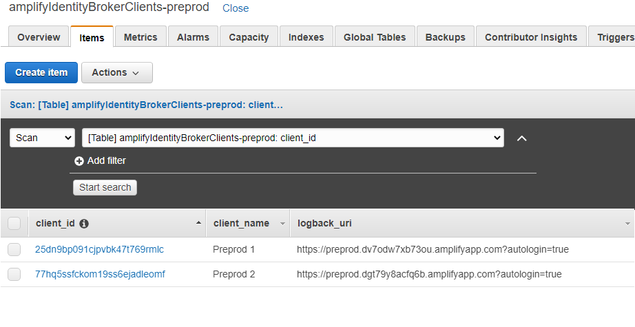

__IMPORTANT__ The client ids have to match what you use in the clientId parameter on your client applications.


## CSS & UI components customization instruction

The Broker code is based on _React_, _aws-amplify_ and _@aws-amplify/ui-react_. While you can customize the CSS, JS and HTML anyway you want, we provide here several tips to make your change more efficients and easier to maintain.

We use CSS Variables to setup the color of the project.

In the file _src/index.css_ we set the root color like that:

```
:root{

  --amplify-primary-color: #008000;
  --amplify-primary-tint: #0000FF; 
  --amplify-primary-shade: #008000;
}
```

For more option on the AWS Amplify UI component look at the [Documentation](https://docs.amplify.aws/ui/customization/theming/q/framework/react)

We've define all CSS extra properties in _src/index.css_, look at this file before any overide.

## Identity Providers

The setup of federation with 3rd party Identity Providers has to be done within the Amazon Cognito User Pool associated with your running broker and a small change is to make on the broker itseld to let him aware of the additionnal IdPs to display (see PREREQUISITE down below).

The changes made against the Amazon Cognito User Pool should be done within the AWS console.

__PREREQUISITE__: 

To add identity providers, you need to insert these providers under the file _config-overrides.js_ which is at the root of the project.
You have to add the settings on the environment you like to modify.

Example:

```
        case "production": localConfig = {
            "providers": ["Provider1", "Provider2", "LoginWithAmazon", "Facebook", "Google"]
          };
            break;
```

Be exact with the name of your OIDC and SAML providers or strings that match what the [Amazon Cognito documentation](https://docs.aws.amazon.com/cognito/latest/developerguide/authorization-endpoint.html) is asking `identity_provider` for social federation.

Note that the label that appear in the button is displayed using the i18n AWS Amplify system. If you want to change the name edit the file _src/strings.js_ and create label that match your provider name.
Example:

```
        Provider1: "Sign In with first provider",
        Provider2: "Sign In with another provider",
        AMAZON_SIGNIN: "Sign In with Amazon",
        GOOGLE_SIGNIN: "Sign In with Google",
        FACEBOOK_SIGNIN: "Sign In with Facebook",
```

See next sections for specific provider steps.

### OIDC Provider (oauth2)

Follow the [Amazon Cognito User Pool OIDC IDP documentation](https://docs.aws.amazon.com/cognito/latest/developerguide/cognito-user-pools-oidc-idp.html). Remember the name you choose for your provider, you have to use it inside _config-overrides.js_ and _src/strings.js_ as explained before.

### SAML Provider

Follow the [Amazon Cognito User Pool SAML IDP documentation](https://docs.aws.amazon.com/cognito/latest/developerguide/cognito-user-pools-saml-idp.html). Remember the name you choose for your provider, you have to use it inside _config-overrides.js_ and _src/strings.js_ as explained before.

### Social Providers

Social Provider instructions taken from [Amazon Cognito Documentation](https://docs.aws.amazon.com/cognito/latest/developerguide/cognito-user-pools-social-idp.html). 

<details>
  <summary>Facebook</summary>

### Step 1: Register with Facebook to get a App ID and App Secret

1. Create a developer account with [Facebook](https://developers.facebook.com/docs/facebook-login). 
2. [Sign in](https://developers.facebook.com) with your Facebook credentials. 
3. From the __My Apps__ menu, choose __Create New App.__ 


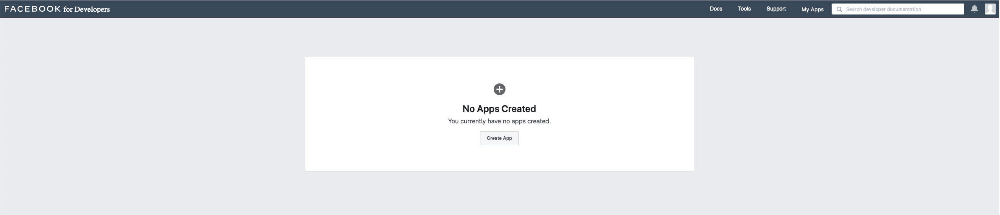


4. Select __For Everything Else,__ give your Facebook app a name and choose __Create App ID.__


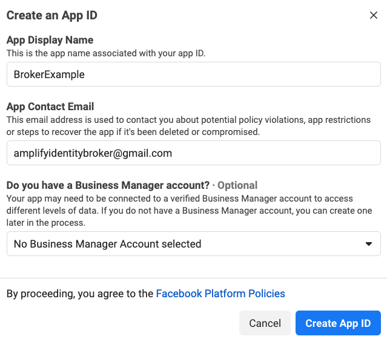


5. On the left navigation bar, choose __Settings__ and then __Basic__.
6. Note the __App ID__ and the __App Secret.__ You will use them when running `amplify init`

### Step 2: Finish registering with Facebook

7. Choose __+ Add Platform__ from the bottom of the page. 
8. Choose __Website__
9. Under __Website,__ type your user pool domain with the /oauth2/idpresponse endpoint into Site URL. 


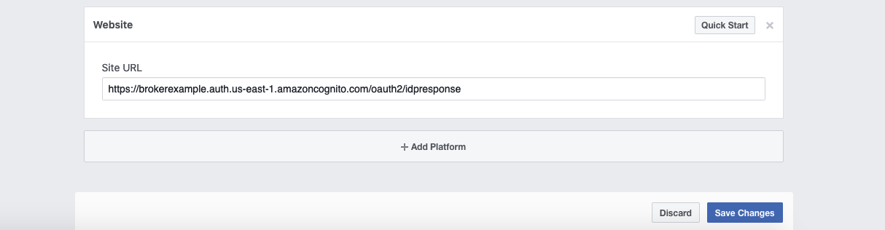


10. Choose __Save changes__
11. Type your user pool domain into __App Domains__


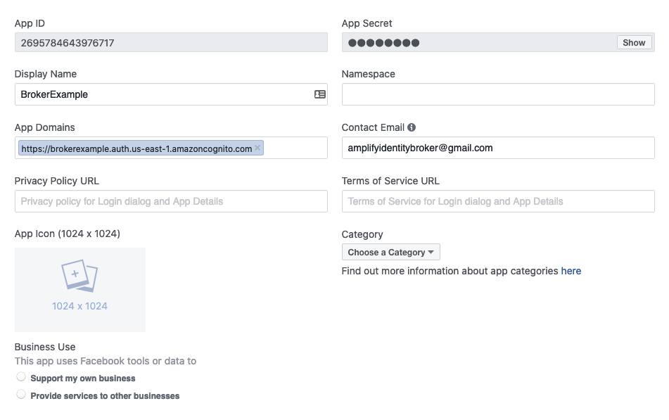


12. Choose __Save changes.__
13. From the navigation bar choose __Products__ and then __Set up__ from __Facebook Login.__ 
14. From the navigation bar choose __Facebook Login__ and then __Settings.__ 
Type your redirect URL into __Valid OAuth Redirect URIs.__ It will consist of your user pool domain with the /oauth2/idpresponse endpoint. 


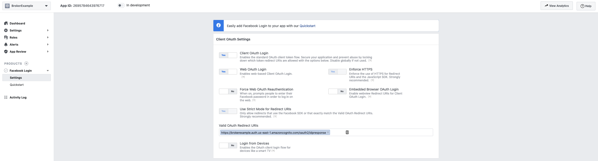


15. Choose __Save changes.__

</details>

<details>
  <summary>Google</summary>

### Step 1: Register with Google to get a OAuth client ID and client secret

1. Create a [developer account with Google.](https://developers.google.com/identity)
2. [Sign in](https://console.developers.google.com) with your Google credentials. 
3. Choose __Create Project__


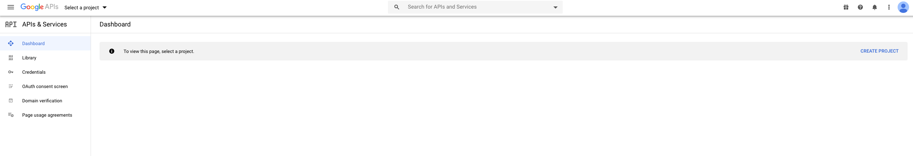


4. Type in a project name and choose __Create__ 
5. On the left navigation bar, choose __OAuth consent screen__
6. Select your User Type and choose __Create__


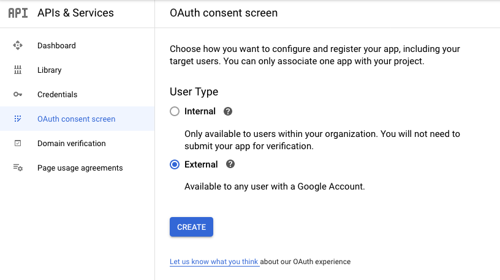


7. Type in an application name and choose __Save__
8. On the left navigation bar, choose __Credentials__
9. Create your OAuth 2.0 credentials by choosing __OAuth client ID__ from the __Create credentials__ drop-down list.


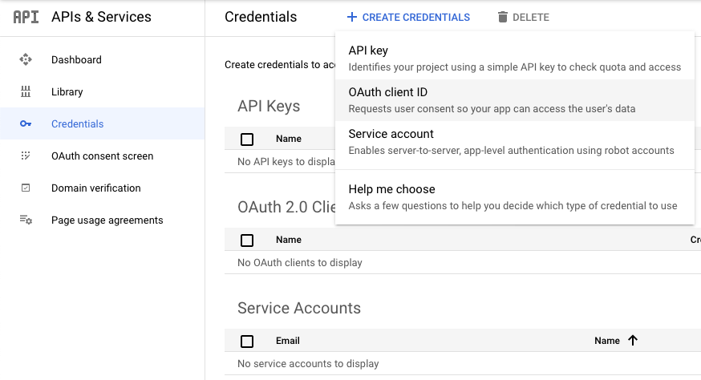


10. Choose __Web application.__ and type in a name for your OAuth 2.0 client
11. Choose __Create.__
12. Note the __OAuth client ID__ and __client secret.__ You will use them when running `amplify init`

### Step 2: Finish registering with Google

13. Click edit on the OAuth 2.0 Client IDs you created in Step 1
14. Type your user pool domain into __Authorized JavaScript origins.__
15. Type your user pool domain with the __/oauth2/idpresponse__ endpoint into __Authorized Redirect URIs.__


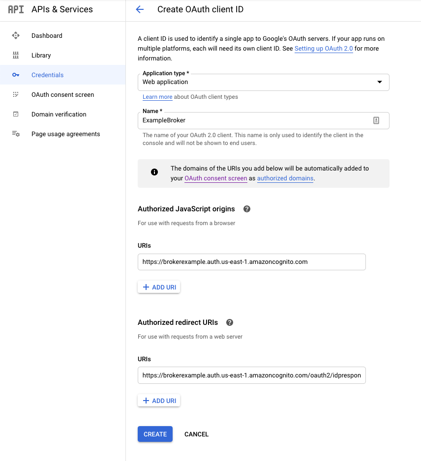

16. Choose __Save__

</details>

<details>
  <summary>Amazon</summary>
  
### Step 1: Register with Amazon to get a Client ID and Client Secret

1. Create a [developer account with Amazon.](https://developer.amazon.com/login-with-amazon)
2. [Sign in](https://developer.amazon.com/dashboard) with your Amazon credentials.
3. You need to create an Amazon security profile to receive the Amazon client ID and client secret. Choose __Apps and Services__ from navigation bar at the top of the page and then choose __Login with Amazon.__
4. Choose __Create a Security Profile.__

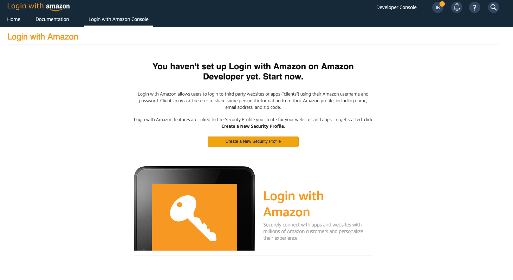


5. Type in a __Security Profile Name,__ a __Security Profile Description,__ and a __Consent Privacy Notice URL.__
6. Choose __Save.__
7. Choose __Client ID__ and __Client Secret__ to show the client ID and secret. You will use them when running `amplify init`

### Step 2: Finish registering with Amazon

8. Hover over the gear and choose __Web Settings,__ and then choose __Edit.__ 
9. Type your user pool domain into __Allowed Origins.__ 
10. Type your user pool domain with the __/oauth2/idpresponse__ endpoint into __Allowed Return URLs.__


11. Choose __Save.__

</details>

## Migration instructions

__DISCLAIMER__:
Migrating credentials from an existing system to Amazon Cognito comes with the risk that these credentials have been exposed in the past. For better security it is recommended to force the users to recreate passwords. The documentation below shows how to migrate users and credentials for learning puspose only.

In this project we provide an example of a Lambda function that migrate users one at a time. For our demo we migrate the users from a _legacy_ Amazon Cognito user pool to the broker user pool. If your pool of user is not Amazon Cognito you'll have to adapt the source code to match with your system APIs.

[Lambda User Migration Code](https://github.com/awslabs/aws-amplify-identity-broker/blob/master/amplify/backend/function/amplifyIdentityBrokerMigration/src/index.js)

[Migration Documentation](https://docs.aws.amazon.com/cognito/latest/developerguide/user-pool-lambda-migrate-user.html#cognito-user-pools-lambda-trigger-syntax-user-migration)

[Cognito SDK Documention](https://docs.aws.amazon.com/AWSJavaScriptSDK/latest/AWS/CognitoIdentityServiceProvider.html)


__Linking the Trigger__:
To use the user migration that is labeled `amplifyIdentityBrokerMigration`, the following setting needs to be enable

1. In the AWS console go to _Amazon Cognito_ -> _User Pool_ -> _brokeruserpool 

2. On the left side menu navigate to Triggers


  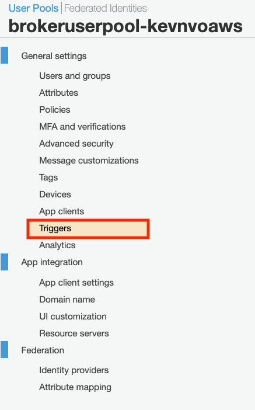

3. In the User Migration click the dropdown list and select Lambda function, if you are using the pre-built one with this project it should be label `amplifyIdentityBrokerMigration-YourENV`


  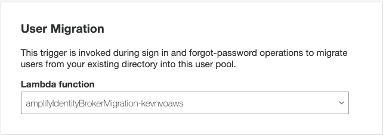

__Important__:
Your app sends the username and password to Amazon Cognito. If your app has a native sign-in UI and uses the Amazon Cognito Identity Provider SDK, your app must use the USER_PASSWORD_AUTH flow, in which the SDK sends the password to the server (your app must not use the default USER_SRP_AUTH flow since the SDK does not send the password to the server in the SRP authentication flow). The USER_PASSWORD_AUTH flow is enabled by setting AuthenticationDetails.authenticationType to "USER_PASSWORD".
 [Switch Authentication Flows](https://docs.amplify.aws/lib/auth/switch-auth/q/platform/js)

 If you like to set a migration flow for a specfic enviroment, follow the these steps:

 1. After your calling your imports in src/App.js of your react frontend, the use the following example.

    Example:
    ```
    Amplify.configure({...awsconfig, 
      Auth: {
        // OPTIONAL - Manually set the authentication flow type. Default is 'USER_SRP_AUTH'
        authenticationFlowType: Config.authenticationFlowType !== undefined ? Config.authenticationFlowType : "USER_SRP_AUTH",
      },
    });
    ```
    This will detect if your authenticationFlowType have been set or not yet, if the authenticationFlowType has not been set then USER_SRP_AUTH will be the assigned flow.

  2. Lastly we need to set the "USER_PASSWORD" flow to the desired enviroment, navigate to config-overrides.js in the root folder and set code with the following example.

      Example:
      ```
      case "Your-ENV": localConfig = {
            // This is added to any ENV that want to use User-Migration, the authenication flow type need to be set to USER_PASSWORD_AUTH from default(USER_SRP_AUTH)
            "authenticationFlowType": "USER_PASSWORD_AUTH",
        };
            break;
      ```
      This will set your specfic enviroment to USER_PASSWORD_AUTH.
