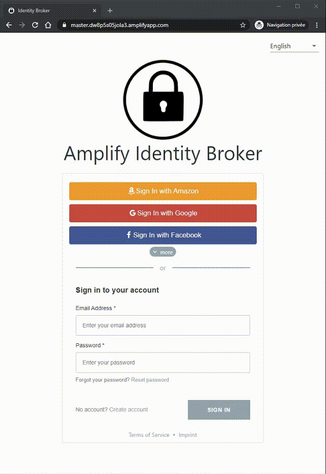

# AWS Amplify Identity Broker: code sample <!-- omit in toc -->

- [Live demo](#live-demo)
- [Documentation](#documentation)
  - [User Documentation](#user-documentation)
  - [Client Developer Documentation](#client-developer-documentation)
  - [Developer Documentation](#developer-documentation)
  - [Comparison with the Amazon Cognito Hosted UI](#comparison-with-the-amazon-cognito-hosted-ui)
- [Architecture](#architecture)
- [Contributing](#contributing)
- [Security](#security)
- [License](#license)

__DISCLAIMER:__ _This project is a code sample provided as an illustration of how to achieve and identity broker and SSO on top of Amazon Cognito. Doing this provides extra flexibility at the price of more responsibility on customer side (see section "Comparison with the Amazon Cognito Hosted UI" for a visual comparison of the responsibility shift). Most customers should use the  [Amazon Cognito hosted UI](https://docs.aws.amazon.com/cognito/latest/developerguide/cognito-user-pools-app-integration.html) as a production ready solution. If you decide to use this project in production make sure you have engineering resources to maintain it as well as expertise to keep it secure._

This project demonstrates how to build a login application to authenticate several websites and mobile apps. It is based on [AWS Amplify](https://aws.amazon.com/amplify/) and [Amazon Cognito](https://aws.amazon.com/cognito/). Authentication is based on standard JWT token and can be integrated with any application supporting Oauth2/OIDC.

__Current features are:__

* login flows: sign-in, sign-up, forgot password, reset-password ...
* central SSO
* is a __standard OIDC Identity Provider__
* 100% UI customizable (fork the project)
* i18n : _languages in this demo: English and French_
* Social login federation: _Facebook, Twitter, Amazon, Google logins_
* Corporate federation: _SAML_ and _OIDC (JWT token)_
* MFA : _SMS, OTP_
* PKCE and Implicit Oauth2 flows : _for secured web and mobile application login_
* deep customization of flows
* Migration helper (transparent migration from an existing user base to this project)
* account setting page with various customer attributes
* SSO dashboard (listing apps)
* consent approbation

This is a simplified view of the scope of the project (what this repository is about):

## Documentation

### User Documentation
- Explains, how to deploy, how to customize the broker, how to migrate from your existing user pool system. Click [here](Documentation/UserDocumentation.md) for details.

### Client Developer Documentation
- Explains how to integrate the broker in your website or mobile application. Click [here](Documentation/ClientDeveloperDocumentation.md) for details.

### Developer Documentation
- Documentation for the contributor of this project, can be found [here](Documentation/DeveloperDocumentation.md) : _PRs are welcome!_

### Comparison with the Amazon Cognito Hosted UI

  
Click to expand!

  
  This project is similar to the [Amazon Cognito hosted UI](https://docs.aws.amazon.com/cognito/latest/developerguide/cognito-user-pools-app-integration.html) by many aspects. Here is the list of similarities and differences.

  __Similarities__

  * both expose similar APIs : they are standard OIDC identity provider (with [few exceptions for the current project](Documentation/UserDocumentation.md#differences-with-the-oidc-standard))
  * feature scope is similar (but this project has more features)
  * both require very low effort to deploy
  * both are managed within the AWS account of the customer

  __Differences__

  * The Hosted UI is managed, you don’t have access to the code or deployment infrastructure. This project is a code project with an simplified deployment system into a Serverless infrastructure you control.
  * This project can be customized deeply. UI, languages, specific behaviors (depending on IP address, link, ...). Again since you have access to the code you can do whatever you want with it
  * This project comes with some missing feature of the Hosted UI: i18n, full CSS, JS customization, consent approbation
  * This project diverge a bit here and there of standard OAuth flows (because of some current restrictions). The limitation is in the way Oauth scope are injected in tokens and some oauth2 API are handled (see [User Documentation](Documentation/UserDocumentation.md#differences-with-the-oidc-standard)). _We are working on it to fill the gap._

  __VISUAL COMPARISON__

  with the Amplify Identity Broker:

  

  with Hosted UI only:

  

## Architecture

The project architecture is the following:

See __[Developer Documentation](Documentation/DeveloperDocumentation.md)__ to see more detailed information on every component. 

## Contributing

Your contribution is welcome, see [CONTRIBUTING](CONTRIBUTING.md) for ideas of PR and for contribution guidelines.

## Security

See [Security Issue Notifications](CONTRIBUTING.md#security-issue-notifications) for more information.

## License

This project is licensed under the MIT License. See the [LICENSE](LICENSE) file.
